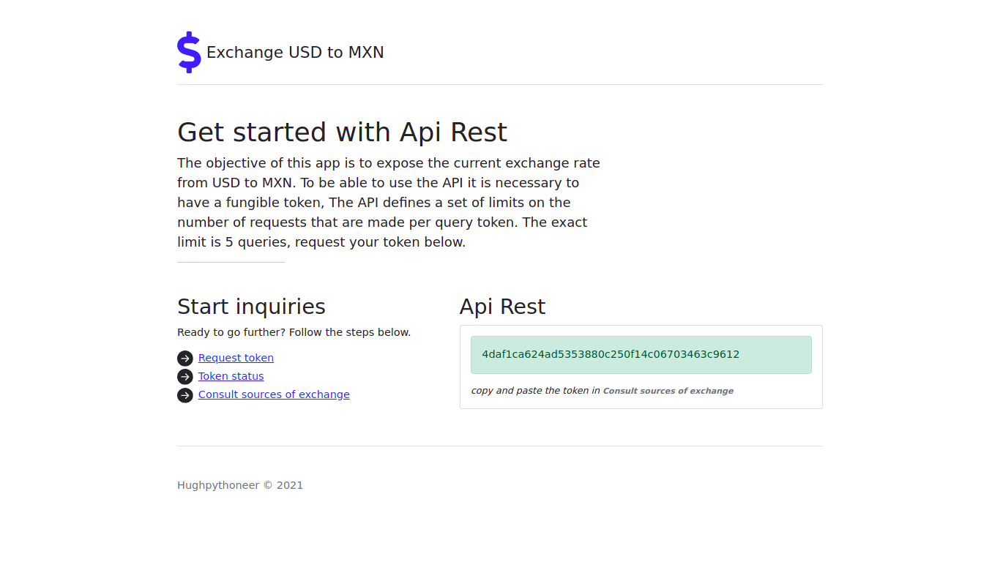

# Exchange Credijusto
*Keep in mind this repository is for local development only and is not meant to be deployed on any production environment! If you're not a developer and just want to try out CREDIJUSTO REST API you can check our [live demo](credijusto.pythonanywhere.com).*



## How to run it local?

## Requirements for Django
> - Django==3.2.4
> - numpy==1.20.3
> - pandas==1.2.4
> - lxml==4.6.3
> - python-decouple==3.4
> - django-crispy-forms==1.11.2
> - django-widget-tweaks==1.4.8

1. Clone the repository:

```
$ git clone https://github.com/Hugh-Dev/credijusto.git --recursive --jobs 3
```

2. Go to the cloned directory:
```
$ cd credijusto
```

4. Apply Django migrations:
```
$ python manage.py makemigrations exchange

$ python manage.py migrate

```
6. Run the application:
```
$ python manage.py runserver 

```

## Requirements for environment
1. [Docker](https://docs.docker.com/install/)
2. [Docker Compose](https://docs.docker.com/compose/install/)

## How to run it?

1. Clone the repository:

```
$ git clone https://github.com/Hugh-Dev/credijusto.git --recursive --jobs 3
```

2. Go to the cloned directory:
```
$ cd credijusto
```

4. Build the application:
```
$ docker-compose build
```

5. Apply Django migrations:
```
$ docker-compose run --rm api python manage.py migrate
```

6. Run the application:
```
$ docker-compose up

```

## Where is the application running?
- Core (API) - http://localhost:8000


If you have any questions or feedback, do not hesitate to contact me:


#### Create ❤️ by [Hughpythoneer](https://hughpythoneer.pythonanywhere.com)

hughpythoneer@gmail.com
